# 🎓 EduTrack - Academy Management System

> **📦 This is the PUBLIC RELEASES repository**  
> Contains only APK releases and documentation. Source code is in a private repository.

---

<div align="center">
  
  
  [](https://flutter.dev/)
  [](https://nextjs.org/)
  [](https://firebase.google.com/)
  [](LICENSE)
</div>

## 📖 What is EduTrack?

EduTrack is a comprehensive **Academy Management Ecosystem** for educational institutions. Three integrated components:

1. **Flutter Mobile App** - Primary academy management interface (Android, iOS, Web, Desktop)
2. **Next.js Admin Portal** - Web dashboard for super admin to manage multiple academies
3. **WhatsApp Bot** - Automated notification service for parents

Manage students, teachers, attendance, exams, fees, and parent communication - all in one platform.

---

## 🔒 Repository Structure

> **Important**: This is the **PRIVATE DEVELOPMENT REPOSITORY** containing full source code.

**📦 Public Releases**: For downloading APK files and viewing public documentation, visit:
- **Download APKs**: https://github.com/mind-flayers/edu-track-releases-releases/releases
- **Public Docs**: https://github.com/mind-flayers/edu-track-releases-releases

**🚀 Automated Releases**: Pushing a version tag (e.g., `v1.0.0`) to this repository automatically:
- Builds production APK files
- Creates release in public repository
- Syncs README and documentation
- See [Release Process Guide](docs/RELEASE_PROCESS.md) for details

---

## 🏗️ System Architecture

```
Flutter App + Next.js Portal + WhatsApp Bot
              ↓
        Firebase Backend
     (Firestore, Auth, Functions)
              ↓
      External Services
   (Cloudinary, WhatsApp Web)
```

### 🎯 Key Features

**Flutter App**: Student/Teacher management • QR-based attendance • Exam results • Fee tracking (monthly/daily) • Analytics dashboard • Excel/PDF export • WhatsApp notifications

**Admin Portal**: Multi-academy management • CSV bulk import • Cloudinary integration • Admin account creation

**WhatsApp Bot**: Automated parent notifications • Message queue • Delivery tracking • Auto-retry • Free 24/7 hosting on Render.com

## 🤔 Why EduTrack?

**Solves**: Manual record keeping • Attendance tracking • Fee management • Report generation • Parent communication

**Benefits**: 70% less admin work • Cloud security • Real-time data access • Multi-platform • Cost-effective

**For**: Schools • Coaching centers • Training institutes • Academy owners looking to digitize operations

## 🚀 Getting Started

### Prerequisites

- Flutter SDK 3.6.0+ • Android Studio or VS Code • Git • Node.js 18+ (for portal/bot)

### 📥 How to Clone and Run This Repository

#### 1. Clone the Repository
```bash
git clone https://github.com/mind-flayers/edu-track-releases.git
cd edu_track

# Initialize and clone the WhatsApp bot submodule (optional)
git submodule init
git submodule update
```

> **Note**: The WhatsApp bot is maintained in a separate repository at [https://github.com/mind-flayers/whatsapp-edutrack-bot](https://github.com/mind-flayers/whatsapp-edutrack-bot) and linked as a git submodule.

---

## 🚀 Component Setup Guides

### 1️⃣ Flutter Mobile App Setup

#### Prerequisites
- Flutter SDK 3.6.0+ ([Install Flutter](https://flutter.dev/docs/get-started/install))
- Android Studio or VS Code with Flutter extensions
- Git

```bash
flutter pub get && flutter doctor

# Use existing Firebase project or create your own at console.firebase.google.com
# Enable: Authentication, Firestore, Storage

# Seed test data (optional)
cd db && npm install
node populate_database.js YOUR_ADMIN_UID

# Run app
flutter run                    # Default device
flutter run -d chrome          # Web
flutter run --release          # Release mode

# Build for production
flutter build apk --release    # Android
flutter build web --release    # Web
```

---

### 2️⃣ Next.js Admin Portal Setup

```bash
cd admin-portal && npm install

# Create .env.local with:
# - SUPER_ADMIN_EMAIL (your email)
# - Firebase Admin SDK credentials (from Firebase Console → Service Accounts)
# - Cloudinary credentials

npm run dev  # Access at localhost:3000
```

**Features**: Create academy accounts • Bulk CSV import • Google Drive photo sync

See [`admin-portal/README.md`](admin-portal/README.md) for details.

---

### 3️⃣ WhatsApp Bot Setup

> **Note**: The WhatsApp bot is a separate repository. Make sure you've initialized the submodule first:
> ```bash
> git submodule init && git submodule update
> ```

```bash
cd whatsapp-edutrack-bot && npm install

# Add service-account-key.json from Firebase Console

npm start       # Terminal 1: Start bot, scan QR code
npm run bridge  # Terminal 2: Start Firebase queue processor
```

**Flow**: Flutter app → Firestore queue → Firebase bridge → WhatsApp bot → Parent's WhatsApp

**Deploy**: Free 24/7 hosting on **Render.com** with Firebase Storage for session persistence and cron-job.org for keep-alive.

**Repository**: [https://github.com/mind-flayers/whatsapp-edutrack-bot](https://github.com/mind-flayers/whatsapp-edutrack-bot)

See the separate repository's README for complete deployment instructions.

---

### 4️⃣ Firebase Functions Setup (Optional)

```bash
cd functions
npm install

# Deploy functions
firebase deploy --only functions

# Test locally
npm run serve
```

## 📁 Repository Structure

```
lib/                    # Flutter app (authentication, dashboard, students, teachers, etc.)
admin-portal/           # Next.js super admin portal
whatsapp-edutrack-bot/  # WhatsApp notification bot (git submodule - separate repository)
functions/              # Firebase Cloud Functions
db/                     # Database scripts and documentation
docs/                   # Deployment and setup guides
```

> **Important**: The `whatsapp-edutrack-bot` directory is a **Git Submodule** pointing to [https://github.com/mind-flayers/whatsapp-edutrack-bot](https://github.com/mind-flayers/whatsapp-edutrack-bot). Use `git submodule init && git submodule update` to clone it.

## 🛠️ Tech Stack

**Flutter App**: Flutter 3.6.0 • GetX • Firebase • Cloudinary • FL Chart • QR Flutter • Excel/PDF export

**Admin Portal**: Next.js 16 • React 19 • Tailwind CSS • Firebase Admin SDK • PapaParse

**WhatsApp Bot**: Node.js 18 • Baileys • Express • PM2 • Firebase Admin SDK

**Backend**: Firebase (Firestore, Auth, Functions, Storage)

## 📊 Database Structure

**Multi-tenant Firestore**: All data scoped under `admins/{adminUid}/`

**Collections**: adminProfile • academySettings • students (with attendance, fees, examResults) • teachers • examTerms • attendanceSummary • whatsappQueue

**Key Features**: Data isolation per academy • PAID/PENDING payment status • Presence-only attendance • Academy-specific subjects • Fee exemption flag • WhatsApp message queue

See [`db/database_structure.md`](db/database_structure.md) for complete schema.

---

## 📸 Screenshots & Demo

### 🔐 Authentication & Dashboard

<div align="center">
  <table>
    <tr>
      <td align="center">
        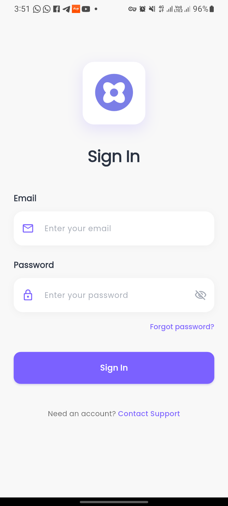<br/>
        <b>Login Page</b><br/>
        <sub>Secure authentication</sub>
      </td>
      <td align="center">
        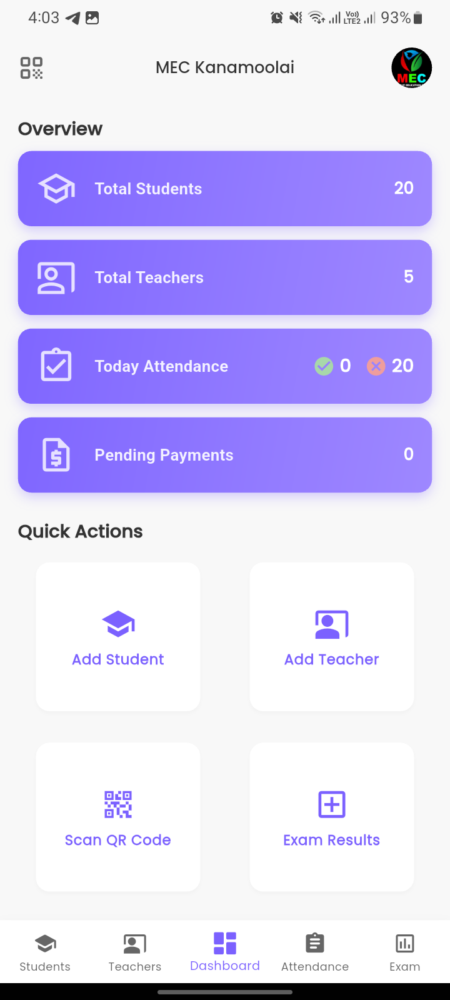<br/>
        <b>Dashboard</b><br/>
        <sub>Analytics overview</sub>
      </td>
      <td align="center">
        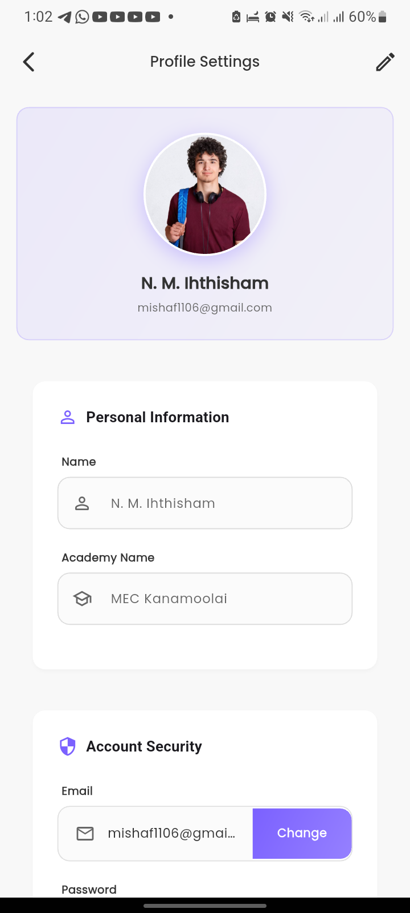<br/>
        <b>Profile Settings</b><br/>
        <sub>Account management</sub>
      </td>
    </tr>
  </table>
</div>

### 👥 Student & Teacher Management

<div align="center">
  <table>
    <tr>
      <td align="center">
        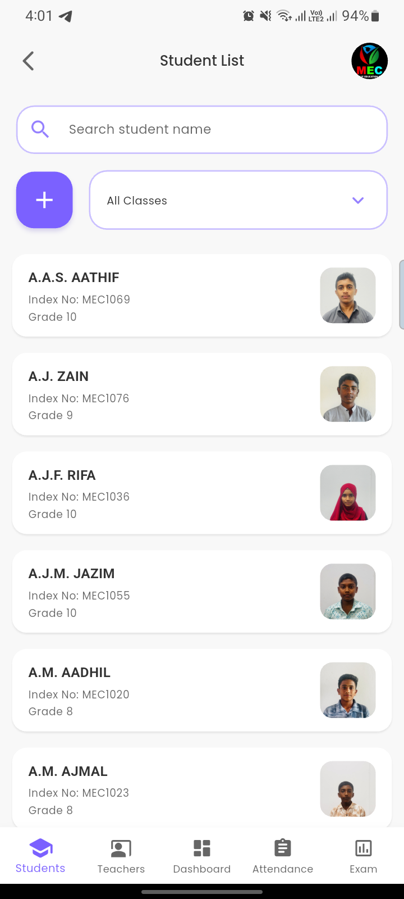<br/>
        <b>Students List</b><br/>
        <sub>View all students</sub>
      </td>
      <td align="center">
        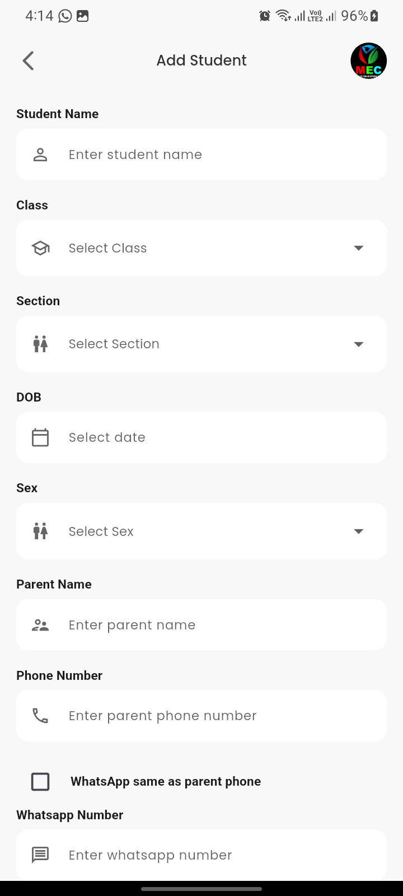<br/>
        <b>Add Student</b><br/>
        <sub>Register new student</sub>
      </td>
      <td align="center">
        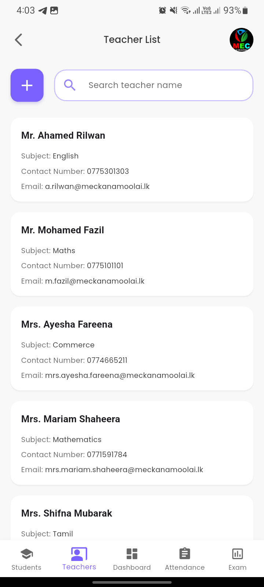<br/>
        <b>Teachers List</b><br/>
        <sub>Manage teachers</sub>
      </td>
    </tr>
  </table>
</div>

### 📋 Student Details & Information

<div align="center">
  <table>
    <tr>
      <td align="center">
        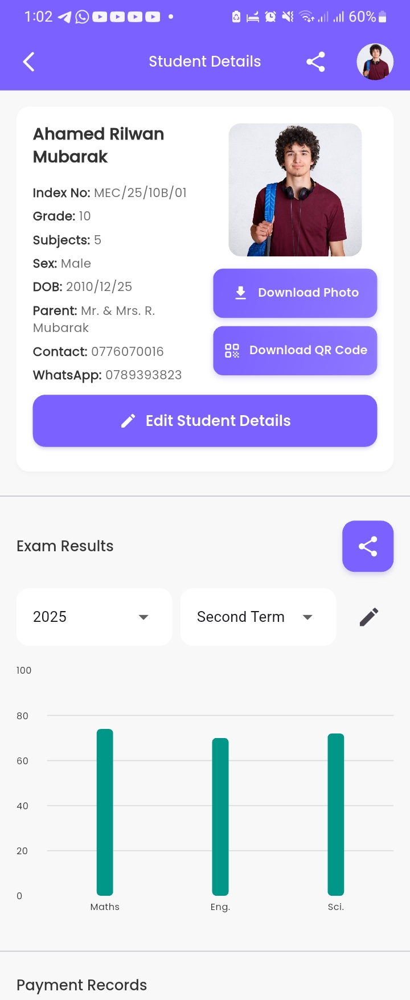<br/>
        <b>Student Profile</b><br/>
        <sub>Personal information</sub>
      </td>
      <td align="center">
        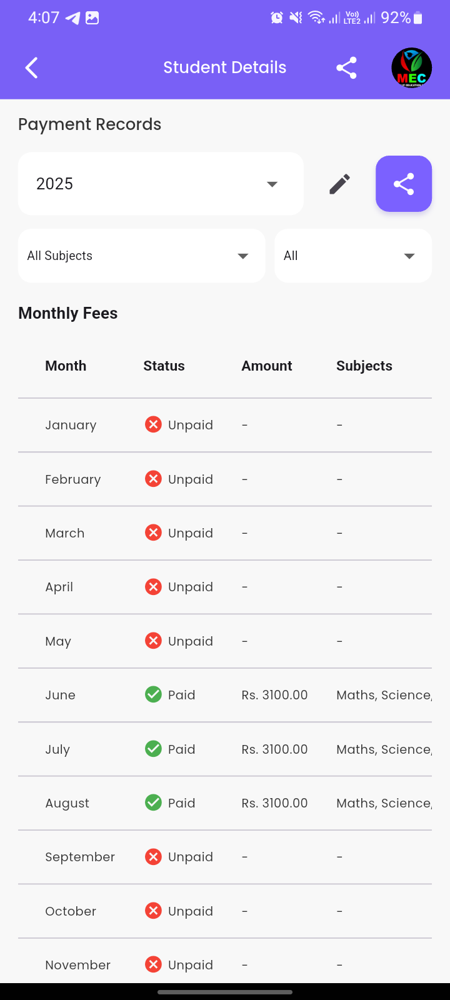<br/>
        <b>Student Details</b><br/>
        <sub>Academic records</sub>
      </td>
      <td align="center">
        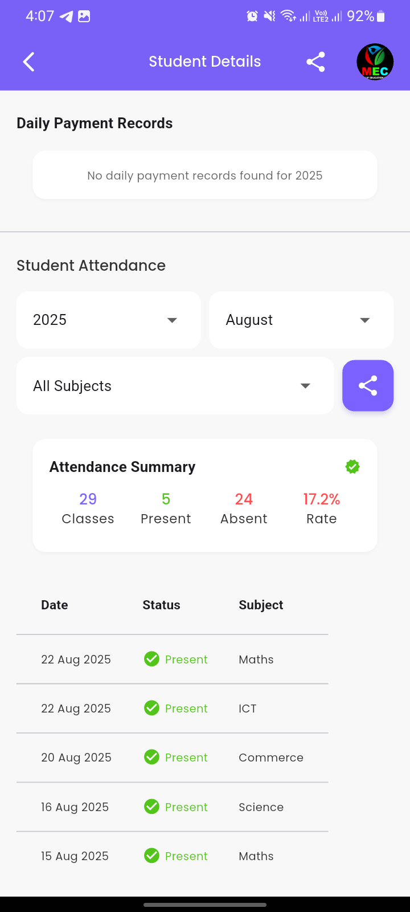<br/>
        <b>Student Info</b><br/>
        <sub>Contact & QR code</sub>
      </td>
    </tr>
  </table>
</div>

### 📱 QR Code Attendance System

<div align="center">
  <table>
    <tr>
      <td align="center">
        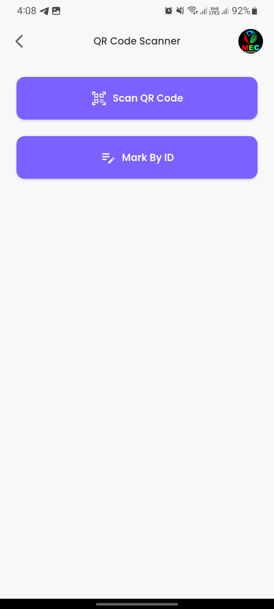<br/>
        <b>QR Scanner</b><br/>
        <sub>Scan student QR</sub>
      </td>
      <td align="center">
        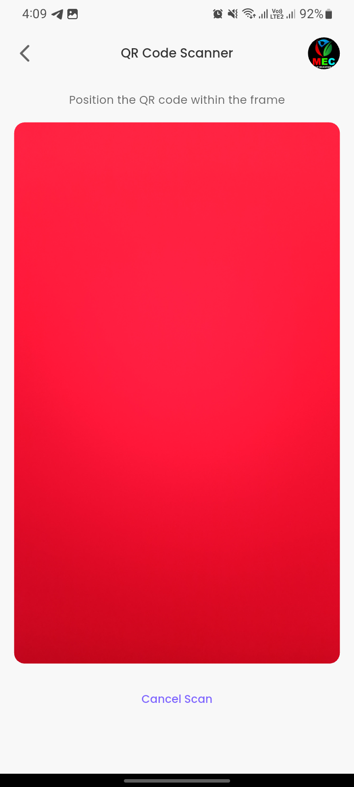<br/>
        <b>Scanning Process</b><br/>
        <sub>Real-time detection</sub>
      </td>
      <td align="center">
        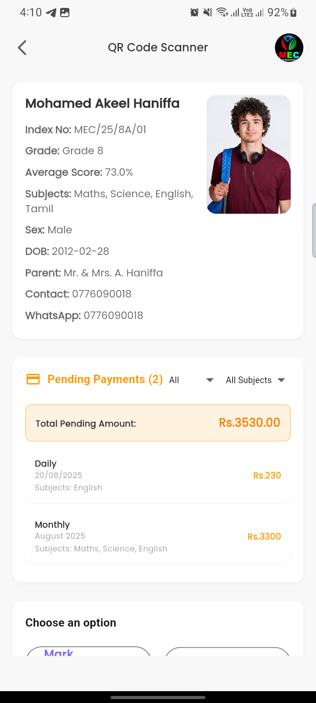<br/>
        <b>Attendance Marked</b><br/>
        <sub>Success confirmation</sub>
      </td>
    </tr>
    <tr>
      <td align="center" colspan="3">
        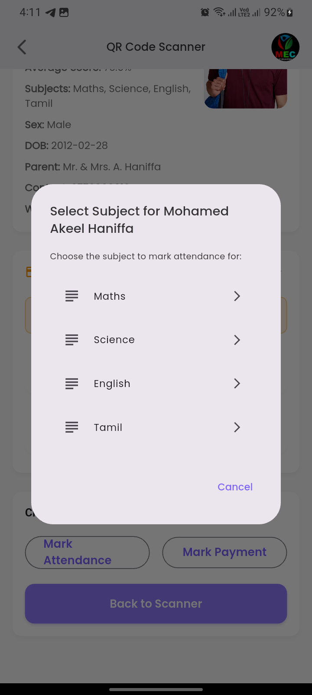<br/>
        <b>Attendance History</b><br/>
        <sub>View attendance records</sub>
      </td>
    </tr>
  </table>
</div>

### 💰 Payment Management & WhatsApp Integration

<div align="center">
  <table>
    <tr>
      <td align="center">
        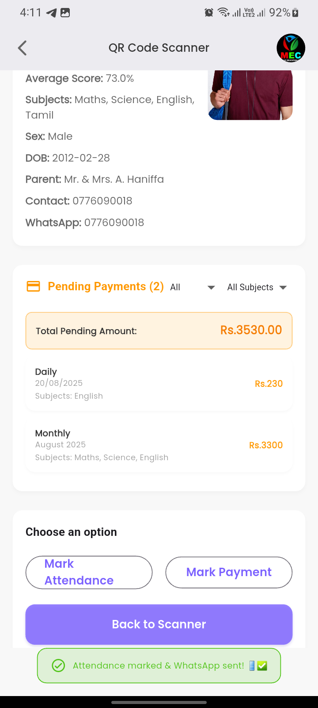<br/>
        <b>Pending Payments</b><br/>
        <sub>Outstanding fees</sub>
      </td>
      <td align="center">
        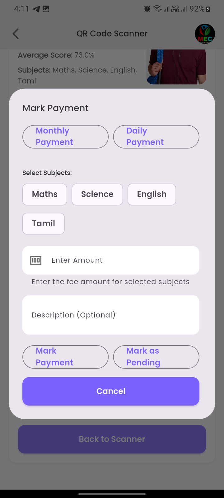<br/>
        <b>Mark Payment</b><br/>
        <sub>Record fee payment</sub>
      </td>
      <td align="center">
        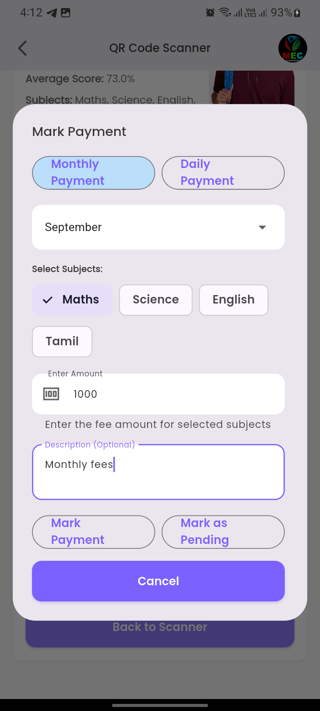<br/>
        <b>Payment Details</b><br/>
        <sub>Enter payment info</sub>
      </td>
    </tr>
    <tr>
      <td align="center" colspan="3">
        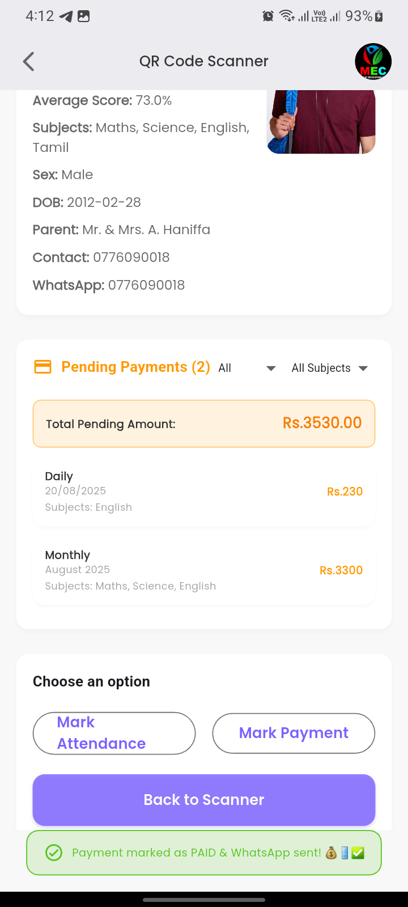<br/>
        <b>WhatsApp Notification</b><br/>
        <sub>Automated parent notification</sub>
      </td>
    </tr>
  </table>
</div>

### 📊 Exam Results & Reports

<div align="center">
  <table>
    <tr>
      <td align="center">
        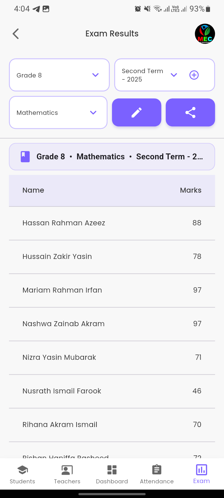<br/>
        <b>Exam Results</b><br/>
        <sub>View all results</sub>
      </td>
      <td align="center">
        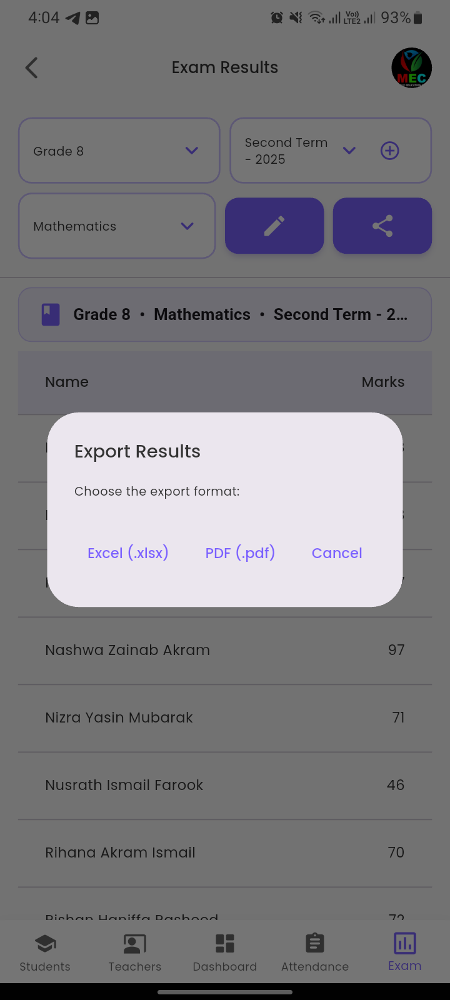<br/>
        <b>Export by Class</b><br/>
        <sub>Bulk export options</sub>
      </td>
      <td align="center">
        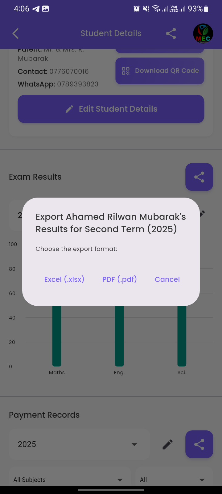<br/>
        <b>Student Results</b><br/>
        <sub>Individual reports</sub>
      </td>
    </tr>
  </table>
</div>

### 📄 Export & Reports

<div align="center">
  <table>
    <tr>
      <td align="center">
        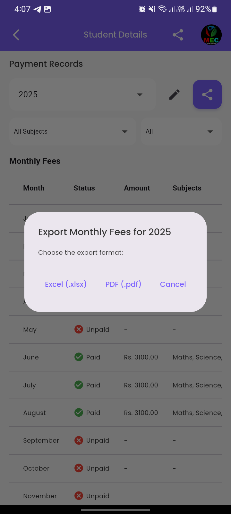<br/>
        <b>Export Payments</b><br/>
        <sub>Financial reports (Excel)</sub>
      </td>
      <td align="center">
        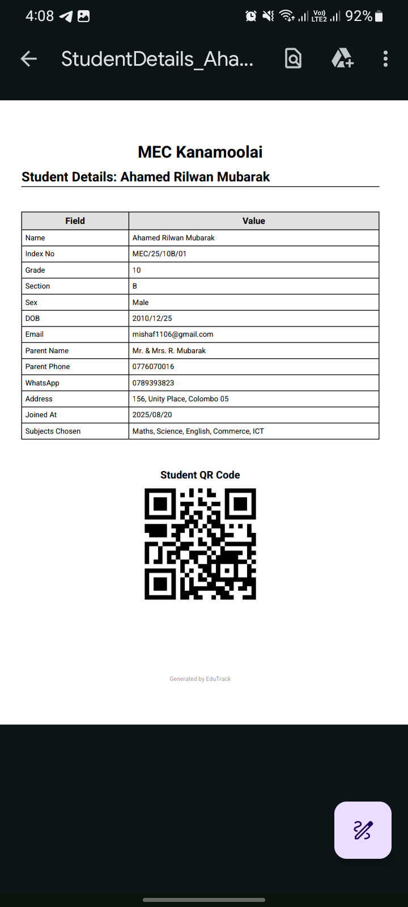<br/>
        <b>Student Details Export</b><br/>
        <sub>Complete data export</sub>
      </td>
    </tr>
  </table>
</div>

---

### 🎥 Promo Video

<div align="center">
  <a href="https://youtu.be/3fHwCYnB2qk" target="_blank">
    
  </a>
  
  <p><b>📹 Click the video above to watch the full app demonstration!</b></p>
  <p><sub>See EduTrack in action with all features showcased</sub></p>
</div>

---

## 🌐 Deployment

**Platforms**: ✅ Android • iOS (Mac required) • Web • Windows • macOS

**Hosting**:
- Flutter App → Google Play, App Store, or direct APK
- Admin Portal → Vercel, Netlify, Firebase Hosting
- WhatsApp Bot → Render.com Free Tier ($0/month) + cron-job.org + Firebase Storage

---

## 🤝 Contributing

Contributions welcome! Fork → Create feature branch → Commit → Push → Open PR

**Guidelines**: Follow [Effective Dart](https://dart.dev/guides/language/effective-dart/style) • Use GetX patterns • Test on multiple platforms • Update docs

**Commit format**: `feat:` `fix:` `docs:` `refactor:` `test:` `chore:`

**Priority areas**: Bug fixes • iOS testing • Screenshots • Documentation • i18n • Accessibility

See [`.github/copilot-instructions.md`](.github/copilot-instructions.md) for development guide.

## 📄 License

This project is licensed under the MIT License - see the [LICENSE](LICENSE) file for details.


---

## 🆘 Support

**Contact**: Mishaf Hasan • mishaf1106@gmail.com

**Issues**: [GitHub Issues](https://github.com/mind-flayers/edu-track-releases/issues) - Include component, platform, steps to reproduce

**Help**: Check docs → Search existing issues → Create new issue → Email support

---

## 🔮 Roadmap

**v1.0.0 (Current)**: Flutter app • Admin portal • WhatsApp bot • QR attendance • Payment tracking • Exam management • Multi-tenant architecture

**Planned**: Push notifications • Student/Parent apps • SMS integration • Timetable • Offline mode • Multi-language • Library management • Assignment tracking • Financial reports

**Future**: AI predictions • LMS integration • Virtual classroom • Biometric attendance

---

## ❓ FAQ

**Q: Do I need all three components?**  
Flutter app is minimum. Add portal for bulk imports. Add bot for WhatsApp notifications.

**Q: Is it free?**  
Yes! MIT license. Firebase/Cloudinary have free tiers. Bot runs free on Render.com.

**Q: Platforms supported?**  
Android, iOS (Mac needed), Web, Windows, macOS

**Q: Multi-tenant how?**  
All data scoped under `admins/{adminUid}` - complete isolation per academy.

**Q: WhatsApp bot cost?**  
$0/month on Render.com free tier with cron-job.org keep-alive and Firebase Storage for session persistence.

**Q: Customize branding?**  
Yes - update `lib/app/utils/constants.dart` and assets/images/

**Troubleshooting**: Check component-specific READMEs • Search [GitHub Issues](https://github.com/mind-flayers/edu-track-releases/issues) • Email: mishafhasan@gmail.com

---

## 🔒 Security

**Firebase**: Configure Firestore rules • All operations require authentication • API keys are safe for client-side

**Secrets**: Never commit `.env.local`, `service-account-key.json`, or `google-services.json`

**Bot**: Use Helmet/CORS • Secure QR authentication • Use environment variables for secrets on Render.com

See [`admin-portal/SECURITY.md`](admin-portal/SECURITY.md) for details.

---

## 🙏 Acknowledgments

**Technologies**: Flutter • Firebase • GetX • Next.js • Baileys • Cloudinary • Render.com

**Libraries**: FL Chart • Mobile Scanner • QR Flutter • Excel • PDF • Express • PM2 • Tailwind CSS • And many more

**Community**: Stack Overflow • GitHub contributors • Reddit r/FlutterDev

---

## 📄 License

This project is licensed under the **MIT License** - see the [LICENSE](LICENSE) file for details.

**Key Points**:
- ✅ Free to use for personal and commercial projects
- ✅ Can modify and distribute
- ✅ Must include original license and copyright notice
- ❌ No warranty provided

---

## 👨‍💻 About the Developer

**Mishaf Hasan** - Full Stack Developer

Specializing in:
- Flutter mobile app development
- Firebase backend architecture
- Next.js web applications
- WhatsApp bot automation
- Educational technology solutions

**Contact**: mishafhasan@gmail.com

---

## 🌟 Show Your Support

If you find EduTrack helpful, please consider:
- ⭐ **Star this repository** on GitHub
- 🍴 **Fork** and contribute improvements
- 🐛 **Report bugs** to help us improve
- 💡 **Suggest features** you'd like to see
- 📢 **Share** with others who might benefit
- 💬 **Provide feedback** on your experience

---

<div align="center">
  <h3>Made with ❤️ for Educational Institutions</h3>
  <p>Empowering academies with modern technology</p>
  <p>
    <a href="https://github.com/mind-flayers/edu-track-releases">⭐ Star on GitHub</a> •
    <a href="https://github.com/mind-flayers/edu-track-releases/issues">🐛 Report Bug</a> •
    <a href="https://github.com/mind-flayers/edu-track-releases/issues">💡 Request Feature</a>
  </p>
  <p><sub>© 2026 Mishaf Hasan. All rights reserved.</sub></p>
</div>
